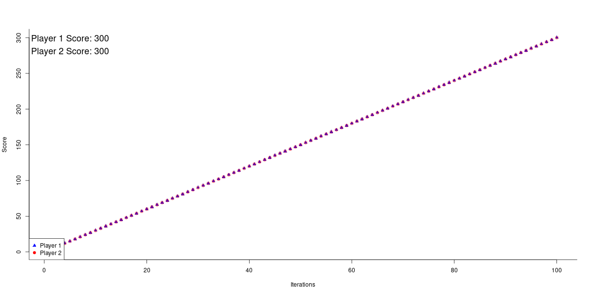
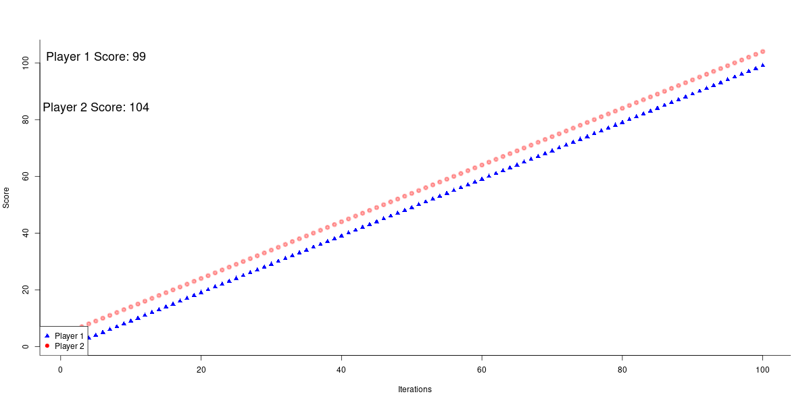
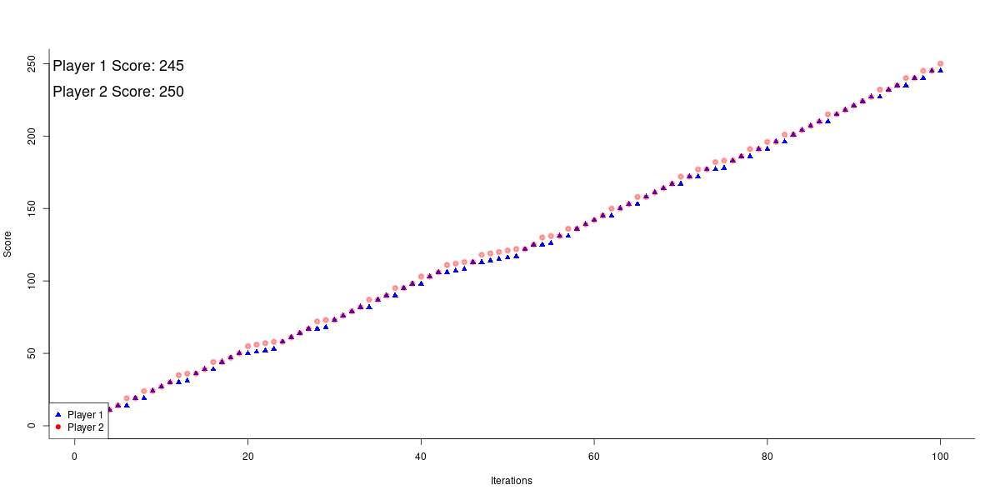
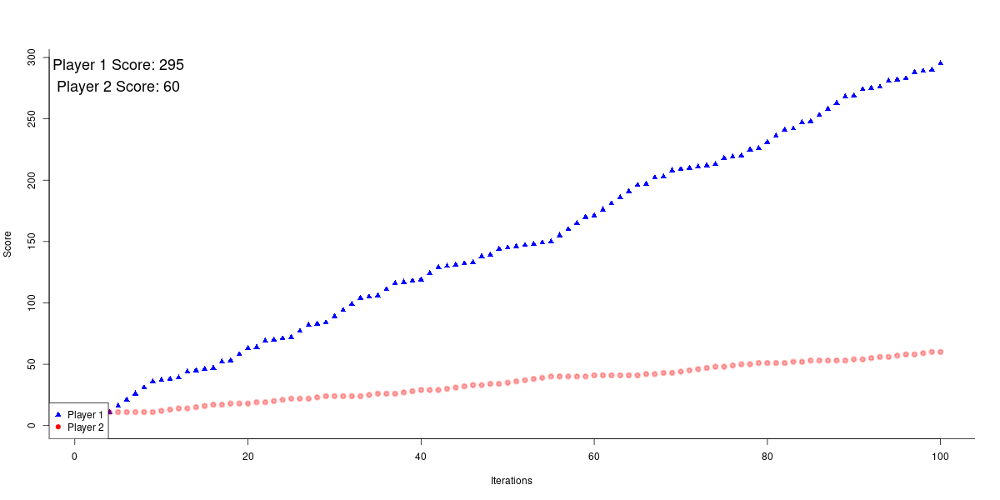
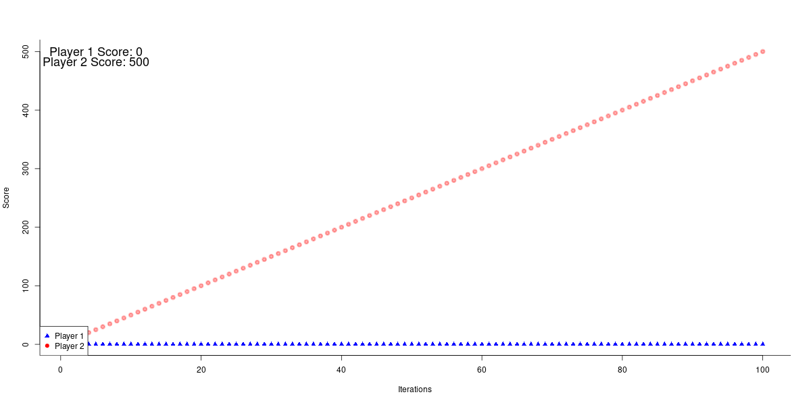
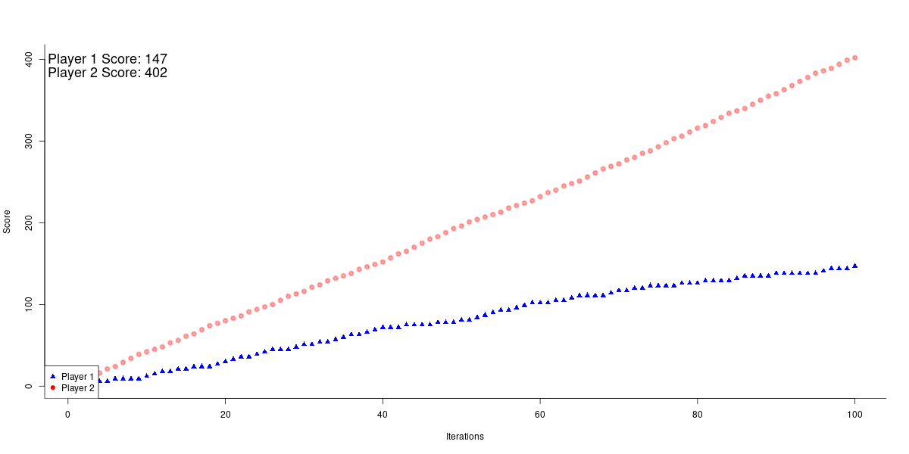
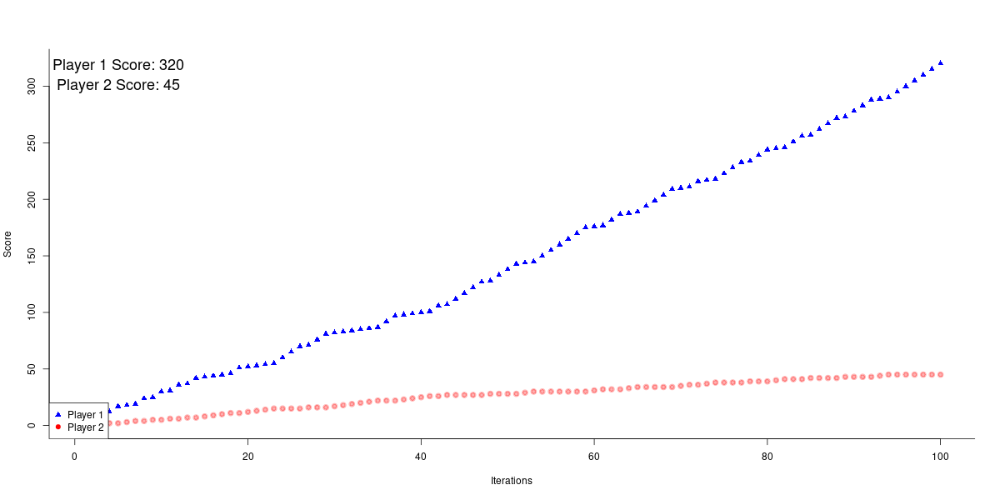

# Simulating a Tournament for Different Strategies in an Iterated Prisoner's Dilemma

## Tit For Tat
```{r}
#' @param player_1_history All moves that player 1 has made so far
#' @param player_2_history All moves that player 2 has made so far
#' @param player Which player is using titfortat
#' @return <list> player_1_history or player_2_history depending on which player uses titfortat
tit_for_tat <- function(player_1_history, player_2_history, player) {
  if (player == "player1") {
    # If this is the first move, then we co-operate
    if (length(player_2_history) == 0) {
      player_1_history <- append(player_1_history, 1)

    } else {
      # otherwise, copy the other player's last move
      player_1_history <- append(player_1_history, player_2_history[length(player_2_history)])

    }

    player_1_history

  } else {
    # If this is the first move, then we co-operate
    if (length(player_2_history) == 0) {
      player_2_history <- append(player_2_history, 1)

    } else {
      # otherwise, copy the oher player's last move
      player_2_history <- append(player_2_history, player_1_history[length(player_1_history)])

    }

    player_2_history

  }

}
```

## Grim Trigger
```{r}
#' @param player_1_history All moves that player 1 has made so far
#' @param player_2_history All moves that player 2 has made so far
#' @param player Which player is using grim trigger
#' @return <list> player_1_history or player_2_history depending on which player uses titfortat
grim_trigger <- function(player_1_history, player_2_history, player) {
  if (player == "player1") {
    # If this is the first move, then we co-operate
    if (length(player_1_history) == 0) {
      player_1_history <- append(player_1_history, 1)

    } else {
      # Otherwise, we defect if the oter player has defected even once
      if (0 %in% player_2_history) {
      player_1_history <- append(player_1_history, 0)  # Player 1 defects if Player 2 has defected
      
      } else {
        player_1_history <- append(player_1_history, 1)  # Player 1 cooperates if Player 2 has not defected

      }

    }

    return(player_1_history)

  } else {
    # If this is the first move, then we co-operate
    if (length(player_2_history) == 0) {
      player_2_history <- append(player_2_history, 1)

    } else {
      # Otherwise, we defect if the other player has defected even once
      if (0 %in% player_1_history) {
        player_2_history <- append(player_2_history, 0)  # Player 2 defects if Player 1 has defected
      
      } else {
        player_2_history <- append(player_2_history, 1)  # Player 2 cooperates if Player 1 has not defected

      }

    }

    return(player_2_history)

  }

}
```

## Always Defect
```{r}
#' @param player_1_history All moves that player 1 has made so far
#' @param player_2_history All moves that player 2 has made so far
#' @param player Which player is using always defect
#' @return <list> player_1_history or player_2_history depending on which player uses always defect
always_defect <- function(player_1_history, player_2_history, player) {
  if (player == "player1") {
    player_1_history <- append(player_1_history, 0)  # Player 1 always defects
    return(player_1_history)

  } else {
    player_2_history <- append(player_2_history, 0)  # Player 2 always defects
    return(player_2_history)

  }

}
```

## Always Cooperate
```{r}
#' @param player_1_history All moves that player 1 has made so far
#' @param player_2_history All moves that player 2 has made so far
#' @param player Which player is using always cooperate
#' @return <list> player_1_history or player_2_history depending on which player uses always cooperate
always_cooperate <- function(player_1_history, player_2_history, player) {
  if (player == "player1") {
    player_1_history <- append(player_1_history, 1)  # Player 1 always cooperates
    return(player_1_history)

  } else {
    player_2_history <- append(player_2_history, 1)  # Player 2 always cooperates
    return(player_2_history)

  }

}
```

## Random Strategy
```{r}
#' @param player_1_history All moves that player 1 has made so far
#' @param player_2_history All moves that player 2 has made so far
#' @param player Which player is using random strategy
#' @return <list> player_1_history or player_2_history depending on which player uses random strategy
random_strategy <- function(player_1_history, player_2_history, player) {
  if (player == "player1") {
    player_1_history <- append(player_1_history, sample(0:1, 1))  # Player 1 randomly chooses to cooperate or defect
    return(player_1_history)

  } else {
    player_2_history <- append(player_2_history, sample(0:1, 1))  # Player 2 randomly chooses to cooperate or defect
    return(player_2_history)

  }

}
```

## Evaluation
```{r}
evaluate <- function(v1, v2) {
  # Initialize scores
  score1 <- score2 <- 0
  score_1_arr <- numeric(length(v1))
  score_2_arr <- numeric(length(v2))
  
  # Initialize scores array
  score_1_arr[1] <- score1
  score_2_arr[1] <- score2
  
  # Iterate through the moves
  for (i in seq_along(v1)) {
    if (v1[i] == 1 && v2[i] == 1) {
      score1 <- score1 + 3
      score2 <- score2 + 3
    } else if (v1[i] == 0 && v2[i] == 0) {
      score1 <- score1 + 1
      score2 <- score2 + 1
    } else if (v1[i] == 1 && v2[i] == 0) {
      score2 <- score2 + 5
    } else {
      score1 <- score1 + 5
    }

    # Update scores array
    score_1_arr[i] <- score1
    score_2_arr[i] <- score2

  }

  print("inside evaluate")
  cat("score_1_arr = ", score_1_arr, "\n")
  cat("score_2_arr = ", score_2_arr, "\n")
  
  return(list(score1 = score1, 
              score2 = score2, 
              score_1_arr = score_1_arr, 
              score_2_arr = score_2_arr
            )
          )

}
```

```{r}
evaluate_and_plot <- function(player_1_moves, player_2_moves) {
  temp <- evaluate(player_1_moves, player_2_moves)
  player_1_score <- temp$score1
  player_2_score <- temp$score2
  player_1_score_arr <- temp$score_1_arr
  player_2_score_arr <- temp$score_2_arr

  xValue <- 1:100
  yValue <- c(1, max(player_1_score, player_2_score))

  plot(player_1_score_arr ~ xValue, type="b", 
    col=rgb(0, 0, 1, 1), bty="l", xlab="Iterations", ylab="Score", lwd=3, pch=17, ylim=yValue
  )

  lines(player_2_score_arr ~ xValue, col=rgb(1, 0, 0, 0.3), lwd=3, pch=19, type="b")

  legend("bottomleft",
        legend = c("Player 1", "Player 2"),
        pch = c(17, 19),
        col=c("blue", "red"))

  text(x = 5, y = max(player_1_score_arr, player_2_score_arr) - 2,
       labels = paste("Player 1 Score:", player_1_score), col = "black", cex = 1.5)
  
  text(x = 5, y = max(player_1_score_arr, player_2_score_arr) - 20,
       labels = paste("Player 2 Score:", player_2_score), col = "black", cex = 1.5)

  return(list(player_1_score = player_1_score, 
              player_2_score = player_2_score, 
              player_1_score_arr = player_1_score_arr, 
              player_2_score_arr = player_2_score_arr
            )
          )

  
}
```

## The Tournament
```{r}
library(ggplot2)
tft_final_score <- 0
gt_final_score <- 0
ac_final_score <- 0
ad_final_score <- 0
rs_final_score <- 0
```

### Tit for Tat

```{r}
# Tit for Tat vs Grim Trigger
player_1_moves <- player_2_moves <- c()


# We assume player 1 plays tit for tat and player 2 plays grim trigger
for (i in 1:100) {
  player_1_moves <- tit_for_tat(player_1_moves, player_2_moves, "player1")
  player_2_moves <- grim_trigger(player_1_moves, player_2_moves, "player2")

}

png("./plots/titfortat vs grim trigger.png", width = 1200, height = 600)

temp <- evaluate_and_plot(player_1_moves, player_2_moves)
tft_final_score <- tft_final_score + temp$player_1_score
gt_final_score <- gt_final_score + temp$player_2_score

dev.off()  # Close device and write file


```

**Results**


```{r}
# Tit for Tat vs Always Co-operate
player_1_moves <- player_2_moves <- c()

# We assume player 1 plays tit for tat and player 2 plays grim trigger
for (i in 1:100) {
  player_1_moves <- tit_for_tat(player_1_moves, player_2_moves, "player1")
  player_2_moves <- always_cooperate(player_1_moves, player_2_moves, "player2")

}

png("./plots/titfortat vs always co-operate.png", width = 1200, height = 600)

temp <- evaluate_and_plot(player_1_moves, player_2_moves)
tft_final_score <- tft_final_score + temp$player_1_score
ac_final_score <- ac_final_score + temp$player_2_score

dev.off()  # Close device and write file


```

**Results**


```{r}
# Tit for Tat vs Always Defect
player_1_moves <- player_2_moves <- c()

# We assume player 1 plays tit for tat and player 2 plays grim trigger
for (i in 1:100) {
  player_1_moves <- tit_for_tat(player_1_moves, player_2_moves, "player1")
  player_2_moves <- always_defect(player_1_moves, player_2_moves, "player2")

}

png("./plots/titfortat vs always defect.png", width = 1200, height = 600)

temp <- evaluate_and_plot(player_1_moves, player_2_moves)
tft_final_score <- tft_final_score + temp$player_1_score
ad_final_score <- ad_final_score + temp$player_2_score

dev.off()  # Close device and write file


```

**Results**


```{r}
# Tit for Tat vs Random
player_1_moves <- player_2_moves <- c()

# We assume player 1 plays tit for tat and player 2 plays grim trigger
for (i in 1:100) {
  player_1_moves <- tit_for_tat(player_1_moves, player_2_moves, "player1")
  player_2_moves <- random_strategy(player_1_moves, player_2_moves, "player2")

}

png("./plots/titfortat vs random.png", width = 1200, height = 600)

temp <- evaluate_and_plot(player_1_moves, player_2_moves)
tft_final_score <- tft_final_score + temp$player_1_score
rs_final_score <- rs_final_score + temp$player_2_score

dev.off()  # Close device and write file


```

**Results**


## Grim Trigger

```{r}
# Grim Trigger vs Always Co-operate
player_1_moves <- player_2_moves <- c()

# We assume player 1 plays tit for tat and player 2 plays grim trigger
for (i in 1:100) {
  player_1_moves <- grim_trigger(player_1_moves, player_2_moves, "player1")
  player_2_moves <- always_cooperate(player_1_moves, player_2_moves, "player2")

}

png("./plots/grim trigger vs always co-operate.png", width = 1200, height = 600)

temp <- evaluate_and_plot(player_1_moves, player_2_moves)
gt_final_score <- gt_final_score + temp$player_1_score
ac_final_score <- ac_final_score + temp$player_2_score

dev.off()  # Close device and write file


```

**Results**


```{r}
# Grim Trigger vs Always Defect
player_1_moves <- player_2_moves <- c()

# We assume player 1 plays tit for tat and player 2 plays grim trigger
for (i in 1:100) {
  player_1_moves <- grim_trigger(player_1_moves, player_2_moves, "player1")
  player_2_moves <- always_defect(player_1_moves, player_2_moves, "player2")

}

png("./plots/grim trigger vs always defect.png", width = 1200, height = 600)

temp <- evaluate_and_plot(player_1_moves, player_2_moves)
gt_final_score <- gt_final_score + temp$player_1_score
ad_final_score <- ad_final_score + temp$player_2_score

dev.off()  # Close device and write file


```

**Results**


```{r}
# Grim Trigger vs Random
player_1_moves <- player_2_moves <- c()

# We assume player 1 plays tit for tat and player 2 plays grim trigger
for (i in 1:100) {
  player_1_moves <- grim_trigger(player_1_moves, player_2_moves, "player1")
  player_2_moves <- random_strategy(player_1_moves, player_2_moves, "player2")

}

png("./plots/grim trigger vs random.png", width = 1200, height = 600)

temp <- evaluate_and_plot(player_1_moves, player_2_moves)
gt_final_score <- gt_final_score + temp$player_1_score
rs_final_score <- rs_final_score + temp$player_2_score

dev.off()  # Close device and write file


```

**Results**


### Always Co-operate

```{r}
# Always Co-operate vs Always Defect
player_1_moves <- player_2_moves <- c()

# We assume player 1 plays tit for tat and player 2 plays grim trigger
for (i in 1:100) {
  player_1_moves <- always_cooperate(player_1_moves, player_2_moves, "player1")
  player_2_moves <- always_defect(player_1_moves, player_2_moves, "player2")

}

png("./plots/always co-operate vs always defect.png", width = 1200, height = 600)

temp <- evaluate_and_plot(player_1_moves, player_2_moves)
ac_final_score <- ac_final_score + temp$player_1_score
ad_final_score <- ad_final_score + temp$player_2_score

dev.off()  # Close device and write filealways co-operate


```

**Results**


```{r}
# Always Co-operate vs Random
player_1_moves <- player_2_moves <- c()

# We assume player 1 plays tit for tat and player 2 plays grim trigger
for (i in 1:100) {
  player_1_moves <- always_cooperate(player_1_moves, player_2_moves, "player1")
  player_2_moves <- random_strategy(player_1_moves, player_2_moves, "player2")

}

png("./plots/always co-operate vs random.png", width = 1200, height = 600)

temp <- evaluate_and_plot(player_1_moves, player_2_moves)
ac_final_score <- ac_final_score + temp$player_1_score
rs_final_score <- rs_final_score + temp$player_2_score

dev.off()  # Close device and write filealways co-operate


```

**Results**


### Always Defect

```{r}
# Always Defect vs Random
player_1_moves <- player_2_moves <- c()

# We assume player 1 plays tit for tat and player 2 plays grim trigger
for (i in 1:100) {
  player_1_moves <- always_defect(player_1_moves, player_2_moves, "player1")
  player_2_moves <- random_strategy(player_1_moves, player_2_moves, "player2")

}

png("./plots/always defect vs random.png", width = 1200, height = 600)

temp <- evaluate_and_plot(player_1_moves, player_2_moves)
ad_final_score <- ad_final_score + temp$player_1_score
rs_final_score <- rs_final_score + temp$player_2_score

dev.off()  # Close device and write filealways co-operate


```

**Results**


## Comparison

```{r}
# Standardizing the scores
mean_x <- mean(c(tft_final_score, gt_final_score, ac_final_score, ad_final_score, rs_final_score))
var_x <- var(c(tft_final_score, gt_final_score, ac_final_score, ad_final_score, rs_final_score))
tft <- (tft_final_score - mean_x) / var_x
gt <- (gt_final_score - mean_x) / var_x
ac <- (ac_final_score - mean_x) / var_x
ad <- (ad_final_score - mean_x) / var_x
rs <- (rs_final_score - mean_x) / var_x

png("comparison.png", width=1200, height=600)

data <- data.frame(
  x = c("Tit for Tat", "Grim Trigger", "Always Co-operate", "Always Defect", "Random"),
  y = c(tft, gt, ac, ad, rs)
)

ggplot(data, aes(x = x, y = y)) + 
  geom_segment(aes(x = x, xend = x, y = 0, yend = y), size = 2, color = "blue", linetype = "dotdash") + 
  geom_point(size=5) + 
  labs(x = "Strategy", y = "Final Score") +
  theme_minimal() +
  theme(
    axis.text.x = element_text(size = 16),     # x-axis label size
    axis.text.y = element_text(size = 14),     # y-axis label size
    axis.title.x = element_text(size = 18),    # x-axis title size
    axis.title.y = element_text(size = 18),    # y-axis title size
    plot.title = element_text(size = 20, face = "bold")
  
  )

dev.off()

```

**Results**


<br>
<br>
<br>
<br>
<br>