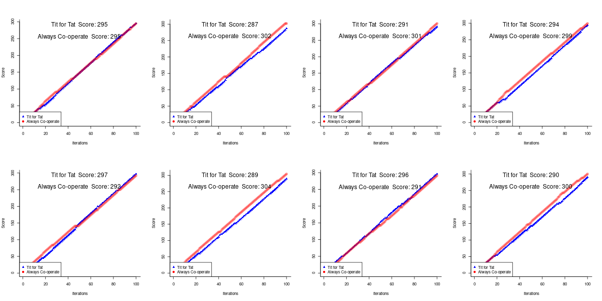
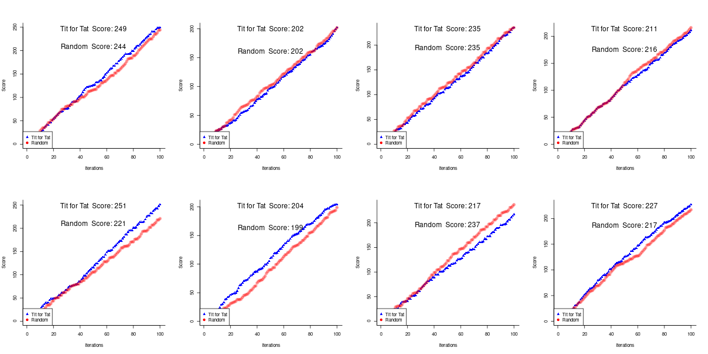
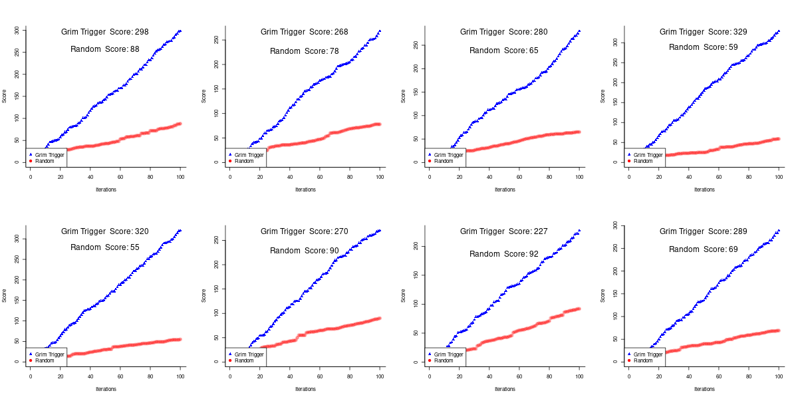
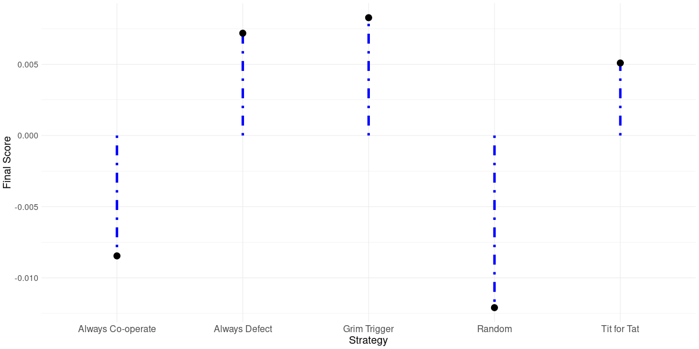

## Simulating a Tournament for Different Strategies in an Iterated Prisoner's Dilemma

### Tit For Tat
```{r}
#' @param player_1_history All moves that player 1 has made so far
#' @param player_2_history All moves that player 2 has made so far
#' @param player Which player is using titfortat
#' @return <list> player_1_history or player_2_history depending on which player uses titfortat
tit_for_tat <- function(player_1_history, player_2_history, player) {
  if (player == "player1") {
    # If this is the first move, then we co-operate
    if (length(player_2_history) == 0) {
      player_1_history <- append(player_1_history, 1)

    } else {
      # otherwise, copy the other player's last move
      player_1_history <- append(player_1_history, player_2_history[length(player_2_history)])

    }

    player_1_history

  } else {
    # If this is the first move, then we co-operate
    if (length(player_2_history) == 0) {
      player_2_history <- append(player_2_history, 1)

    } else {
      # otherwise, copy the oher player's last move
      player_2_history <- append(player_2_history, player_1_history[length(player_1_history)])

    }

    player_2_history

  }

}
```

### Grim Trigger
```{r}
#' @param player_1_history All moves that player 1 has made so far
#' @param player_2_history All moves that player 2 has made so far
#' @param player Which player is using grim trigger
#' @return <list> player_1_history or player_2_history depending on which player uses titfortat
grim_trigger <- function(player_1_history, player_2_history, player) {
  if (player == "player1") {
    # If this is the first move, then we co-operate
    if (length(player_1_history) == 0) {
      player_1_history <- append(player_1_history, 1)

    } else {
      # Otherwise, we defect if the oter player has defected even once
      if (0 %in% player_2_history) {
      player_1_history <- append(player_1_history, 0)  # Player 1 defects if Player 2 has defected
      
      } else {
        player_1_history <- append(player_1_history, 1)  # Player 1 cooperates if Player 2 has not defected

      }

    }

    return(player_1_history)

  } else {
    # If this is the first move, then we co-operate
    if (length(player_2_history) == 0) {
      player_2_history <- append(player_2_history, 1)

    } else {
      # Otherwise, we defect if the other player has defected even once
      if (0 %in% player_1_history) {
        player_2_history <- append(player_2_history, 0)  # Player 2 defects if Player 1 has defected
      
      } else {
        player_2_history <- append(player_2_history, 1)  # Player 2 cooperates if Player 1 has not defected

      }

    }

    return(player_2_history)

  }

}
```

### Always Defect
```{r}
#' @param player_1_history All moves that player 1 has made so far
#' @param player_2_history All moves that player 2 has made so far
#' @param player Which player is using always defect
#' @return <list> player_1_history or player_2_history depending on which player uses always defect
always_defect <- function(player_1_history, player_2_history, player) {
  if (player == "player1") {
    player_1_history <- append(player_1_history, 0)  # Player 1 always defects
    return(player_1_history)

  } else {
    player_2_history <- append(player_2_history, 0)  # Player 2 always defects
    return(player_2_history)

  }

}
```

### Always Cooperate
```{r}
#' @param player_1_history All moves that player 1 has made so far
#' @param player_2_history All moves that player 2 has made so far
#' @param player Which player is using always cooperate
#' @return <list> player_1_history or player_2_history depending on which player uses always cooperate
always_cooperate <- function(player_1_history, player_2_history, player) {
  if (player == "player1") {
    player_1_history <- append(player_1_history, 1)  # Player 1 always cooperates
    return(player_1_history)

  } else {
    player_2_history <- append(player_2_history, 1)  # Player 2 always cooperates
    return(player_2_history)

  }

}
```

### Random Strategy
```{r}
#' @param player_1_history All moves that player 1 has made so far
#' @param player_2_history All moves that player 2 has made so far
#' @param player Which player is using random strategy
#' @return <list> player_1_history or player_2_history depending on which player uses random strategy
random_strategy <- function(player_1_history, player_2_history, player) {
  if (player == "player1") {
    player_1_history <- append(player_1_history, sample(0:1, 1))  # Player 1 randomly chooses to cooperate or defect
    return(player_1_history)

  } else {
    player_2_history <- append(player_2_history, sample(0:1, 1))  # Player 2 randomly chooses to cooperate or defect
    return(player_2_history)

  }

}
```

### Evaluation
```{r}
evaluate <- function(v1, v2) {
  # Initialize scores
  score1 <- score2 <- 0
  score_1_arr <- numeric(length(v1))
  score_2_arr <- numeric(length(v2))
  
  # Initialize scores array
  score_1_arr[1] <- score1
  score_2_arr[1] <- score2

  # Noise probability
  noise_prob <- 0.05

  # Apply noise to v1 and v2
  v1 <- ifelse(runif(length(v1)) < noise_prob, 1 - v1, v1)
  v2 <- ifelse(runif(length(v2)) < noise_prob, 1 - v2, v2)
  
  # Iterate through the moves
  for (i in seq_along(v1)) {
    if (v1[i] == 1 && v2[i] == 1) {
      score1 <- score1 + 3
      score2 <- score2 + 3
    } else if (v1[i] == 0 && v2[i] == 0) {
      score1 <- score1 + 1
      score2 <- score2 + 1
    } else if (v1[i] == 1 && v2[i] == 0) {
      score2 <- score2 + 5
    } else {
      score1 <- score1 + 5
    }

    # Update scores array
    score_1_arr[i] <- score1
    score_2_arr[i] <- score2

  }

  print("inside evaluate")
  cat("score_1_arr = ", score_1_arr, "\n")
  cat("score_2_arr = ", score_2_arr, "\n")
  
  return(list(score1 = score1, 
              score2 = score2, 
              score_1_arr = score_1_arr, 
              score_2_arr = score_2_arr
            )
          )

}
```

```{r}
evaluate_and_plot <- function(player_1_moves, player_2_moves, player1, player2) {
  # cat("inide evaluate_and_plot, player_1_moves = ", player_1_moves, "\n")
  # cat("inide evaluate_and_plot, player_2_moves = ", player_2_moves, "\n")
  temp <- evaluate(player_1_moves, player_2_moves)
  player_1_score <- temp$score1
  player_2_score <- temp$score2
  player_1_score_arr <- temp$score_1_arr
  player_2_score_arr <- temp$score_2_arr

  xValue <- 1:100
  yValue <- c(1, max(player_1_score, player_2_score))

  plot(player_1_score_arr ~ xValue, type="b", 
    col=rgb(0, 0, 1, 1), bty="l", xlab="Iterations", ylab="Score", lwd=3, pch=17, ylim=yValue
  )

  lines(player_2_score_arr ~ xValue, col=rgb(1, 0, 0, 0.3), lwd=3, pch=19, type="b")

  legend("bottomleft",
        legend = c(player1, player2),
        pch = c(17, 19),
        col=c("blue", "red"))

  text(x = 50, y = max(player_1_score_arr, player_2_score_arr) - 2,
       labels = paste(player1, " Score:", player_1_score), col = "black", cex = 1.5)
  
  text(x = 50, y = max(player_1_score_arr, player_2_score_arr) - 40,
       labels = paste(player2, " Score:", player_2_score), col = "black", cex = 1.5)

  return(list(strat_1_score = player_1_score, 
              strat_2_score = player_2_score, 
              strat_1_score_arr = player_1_score_arr, 
              strat_2_score_arr = player_2_score_arr
            )
          )

  
}
```

### The Tournament
```{r}
library(ggplot2)
tft_final_score <- 0
gt_final_score <- 0
ac_final_score <- 0
ad_final_score <- 0
rs_final_score <- 0
```

### Tit for Tat

```{r}
play <- function(strat1_func, strat2_func, strat1_name, strat2_name, strat1_final_score, strat2_final_score) {
  results <- list()

  # Eight rounds
  for (i in 1:8) {
    strat1_moves <- strat2_moves <- c()

    # First round strat1 goes first, then alternate
    if (i %% 2 != 0) {
      # 100 iterations
      for (j in 1:100) {
        # Player 1 = strat1, Player 2 = strat2
        strat1_moves <- strat1_func(strat1_moves, strat2_moves, "player1")
        strat2_moves <- strat2_func(strat1_moves, strat2_moves, "player2")

      }

    } else {
      # 100 iterations
      for (j in 1:100) {
        # Player 1 = strat2, Player 2 = strat1
        strat2_moves <- strat2_func(strat2_moves, strat1_moves, "player1")
        strat1_moves <- strat1_func(strat2_moves, strat1_moves, "player2")

      }

    }

    # cat("inside round, gt_moves = ", gt_moves)
    results[[i]] <- list(strat1_moves = strat1_moves, strat2_moves = strat2_moves)

  }

  # cat("results[[1]]$gt_moves = ", results[[1]]$gt_moves)

  plot_path <- paste("./plots/", strat1_name, " vs ", strat2_name, ".png", sep="")
  png(plot_path, width = 1200, height = 600)
  par(mfrow = c(2, 4))

  for (i in 1:8) {
    temp <- evaluate_and_plot(
              results[[i]]$strat1_moves, 
              results[[i]]$strat2_moves,
              strat1_name,
              strat2_name 
            )

  }

  par(mfrow = c(1, 1))
  dev.off()  # Close device and write file

  strat1_final_score <- strat1_final_score + temp$strat_1_score
  strat2_final_score <- strat2_final_score + temp$strat_2_score
  return(c(strat1_final_score, strat2_final_score))

}

```


```{r}

temp <- play(tit_for_tat, grim_trigger, "Tit for Tat", "Grim Trigger", tft_final_score, gt_final_score)
tft_final_score <- temp[1]
gt_final_score <- temp[2]

```

**Results**


```{r}

temp <- play(tit_for_tat, always_cooperate, "Tit for Tat", "Always Co-operate", tft_final_score, ac_final_score)
tft_final_score <- temp[1]
ac_final_score <- temp[2]

```

**Results**


```{r}

temp <- play(tit_for_tat, always_defect, "Tit for Tat", "Always Defect", tft_final_score, ad_final_score)
tft_final_score <- temp[1]
ad_final_score <- temp[2]

```

**Results**


```{r}

temp <- play(tit_for_tat, random_strategy, "Tit for Tat", "Random", tft_final_score, rs_final_score)
tft_final_score <- temp[1]
rs_final_score <- temp[2]

```

**Results**



### Grim Trigger

```{r}

temp <- play(grim_trigger, always_cooperate, "Grim Trigger", "Always Co-operate", gt_final_score, ac_final_score)
gt_final_score <- temp[1]
ac_final_score <- temp[2]

```

**Results**


```{r}

temp <- play(grim_trigger, always_defect, "Grim Trigger", "Always Defect", gt_final_score, ad_final_score)
gt_final_score <- temp[1]
ad_final_score <- temp[2]

```


**Results**


```{r}

temp <- play(grim_trigger, random_strategy, "Grim Trigger", "Random", gt_final_score, rs_final_score)
gt_final_score <- temp[1]
rs_final_score <- temp[2]

```

**Results**


### Always Co-operate

```{r}

temp <- play(always_cooperate, always_defect, "Always Co-operate", "Always Defect", ac_final_score, ad_final_score)
ac_final_score <- temp[1]
ad_final_score <- temp[2]

```

**Results**


```{r}

temp <- play(always_cooperate, random_strategy, "Always Co-operate", "Random", ac_final_score, rs_final_score)
ac_final_score <- temp[1]
rs_final_score <- temp[2]

```

**Results**


### Always Defect

```{r}

temp <- play(always_defect, random_strategy, "Always Defect", "Random", ad_final_score, rs_final_score)
ad_final_score <- temp[1]
rs_final_score <- temp[2]

```


**Results**


### Comparison

```{r}

cat("tft_final_score = ", tft_final_score, "\n")
cat("gt_final_score = ", gt_final_score, "\n")
cat("ac_final_score = ", ac_final_score, "\n")
cat("ad_final_score = ", ad_final_score, "\n")
cat("rs_final_score = ", rs_final_score, "\n")

# Standardizing the scores
mean_x <- mean(c(tft_final_score, gt_final_score, ac_final_score, ad_final_score, rs_final_score))
var_x <- var(c(tft_final_score, gt_final_score, ac_final_score, ad_final_score, rs_final_score))
tft <- (tft_final_score - mean_x) / var_x
gt <- (gt_final_score - mean_x) / var_x
ac <- (ac_final_score - mean_x) / var_x
ad <- (ad_final_score - mean_x) / var_x
rs <- (rs_final_score - mean_x) / var_x

png("comparison.png", width=1200, height=600)

data <- data.frame(
  x = c("Tit for Tat", "Grim Trigger", "Always Co-operate", "Always Defect", "Random"),
  y = c(tft, gt, ac, ad, rs)
)

ggplot(data, aes(x = x, y = y)) + 
  geom_segment(aes(x = x, xend = x, y = 0, yend = y), size = 2, color = "blue", linetype = "dotdash") + 
  geom_point(size=5) + 
  labs(x = "Strategy", y = "Final Score") +
  theme_minimal() +
  theme(
    axis.text.x = element_text(size = 16),     # x-axis label size
    axis.text.y = element_text(size = 14),     # y-axis label size
    axis.title.x = element_text(size = 18),    # x-axis title size
    axis.title.y = element_text(size = 18),    # y-axis title size
    plot.title = element_text(size = 20, face = "bold")
  
  )

dev.off()

```

**Results**


<br>
<br>
<br>
<br>
<br>